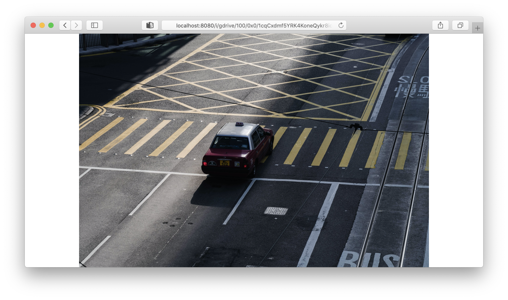
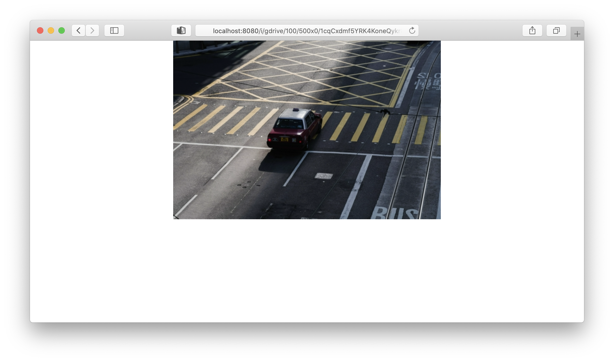
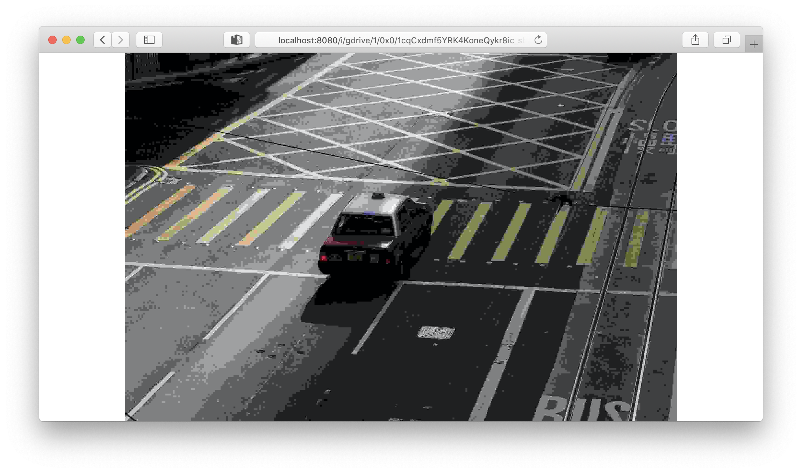
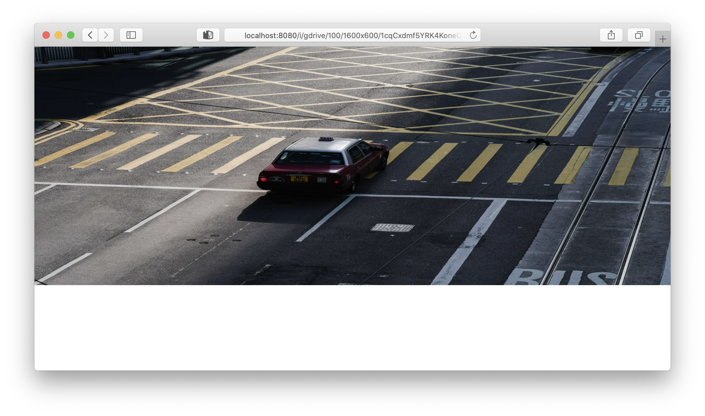
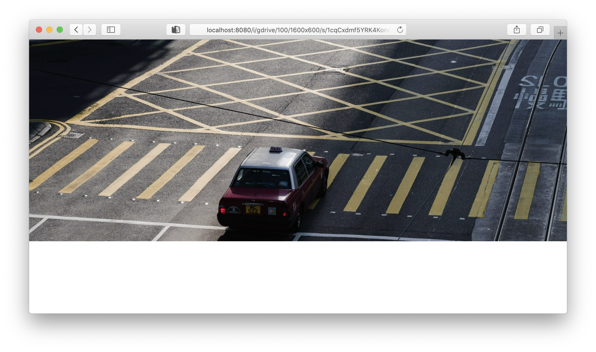
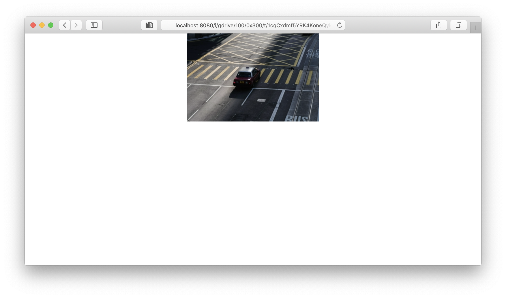
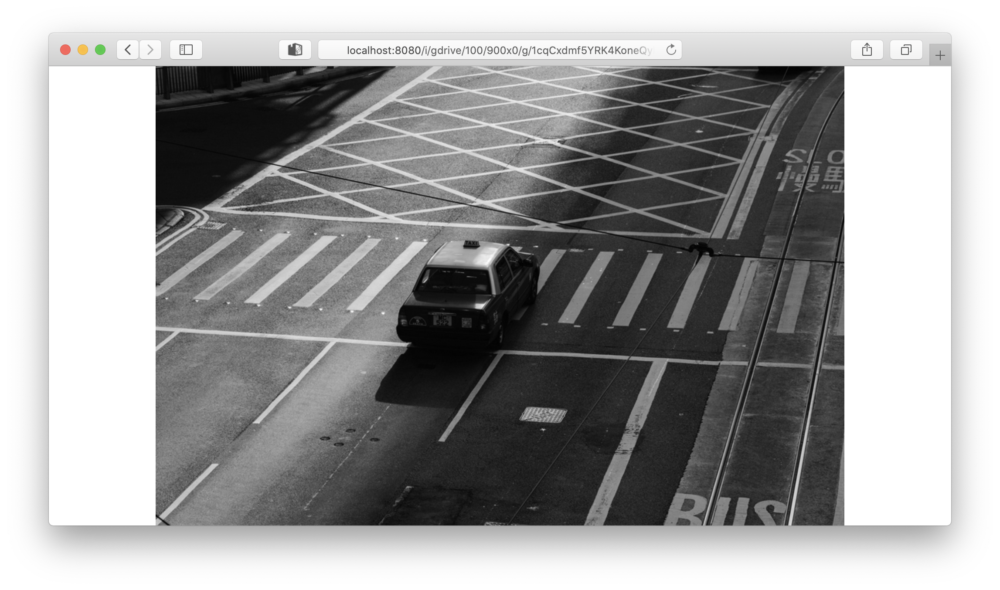

# Host Your Own Image Server based on Google Drive

[](https://sonarcloud.io/dashboard?id=selcukusta_gdrive-image-server)
[](https://sonarcloud.io/dashboard?id=selcukusta_gdrive-image-server)
[](https://sonarcloud.io/dashboard?id=selcukusta_gdrive-image-server)
[](https://sonarcloud.io/dashboard?id=selcukusta_gdrive-image-server)
[](https://sonarcloud.io/dashboard?id=selcukusta_gdrive-image-server)

[](https://github.com/selcukusta/gdrive-image-server/blob/master/LICENSE)

Turn your Google Drive folder to the image hosting service!

## Getting Started

You need to have a Google account to set up the project.

### Setup steps for using Google Drive API

Firstly, create a new project from [Google Developer Console](https://console.developers.google.com/). Go to the **Credentials** menu and create a new **Service Accounts** credential. It might be named as `[PROJECT_ALIAS]-xxxx-xxxxxxx.json`.

Download it and rename as `gcloud-image-server-cred.json`. Put the file to the `/backend` folder (_it will be used for building Docker image_).

Copy your service account mail address (_it will be used for sharing your images with the project_).

### Setup steps for host the images

Go to your Drive page and create a folder, ie. `image-server`.

Share the folder with your service account (_was copied before_). Sharing rule will be applied to the all sub-items in the folder.

As a last step, upload any image (mime should be `image/jpeg` or `image/png`) to the folder and get the ID.

_NOTE: `ID` is not showing anywhere in the portal, it sucks! To catch it, right click your item and select `Get Shareable Link`. Copy the last part of it, and toggle off the sharable link feature._

## Running

- `docker-compose up`

- Go to your favorite browser

- Surf to the URLs such as below.

Two containers will be bringing up. The first one is your image server application. It was written with purely **[the Go programming language](https://golang.org/)**.

Another one is **[Varnish HTTP Cache](https://varnish-cache.org/)**. It will automatically cache the output of the response for 14 days.

## Usage

/i/ endpoint is used for image operations, has two different usages:

```
/i/gdrive/{quality:range(0,100)}/{w:range(0,5000)}x{h:range(0,5000)}/{options:opt}/{*id}

/i/gdrive/{quality:range(0,100)}/{w:range(0,5000)}x{h:range(0,5000)}/{*id}
```

## Options

| Option | Description                                                                                                                                                                                                                         |
| ------ | ----------------------------------------------------------------------------------------------------------------------------------------------------------------------------------------------------------------------------------- |
| `t`    | Make this image into a thumbnail. This method modifies the image to contain a thumbnail version of itself, no larger than the given size. This method calculates an appropriate thumbnail size to preserve the aspect of the image. |
| `g`    | This will convert the given image into a grayscale image.                                                                                                                                                                           |
| `s`    | This will crop the given image smartly with using [this](https://pkg.go.dev/github.com/muesli/smartcrop) package.                                                                                                                   |

## Samples

- **Original size:** `http://127.0.0.1:8080/i/gdrive/100/0x0/[YOUR_FILE_ID]`



- **Resize with aspect ratio:** `http://127.0.0.1:8080/i/gdrive/100/500x0/[YOUR_FILE_ID]`



- **Less quality:** `http://127.0.0.1:8080/i/gdrive/1/0x0/[YOUR_FILE_ID]`



- **Resize without aspect ratio:** `http://127.0.0.1:8080/i/gdrive/100/1600x600/[YOUR_FILE_ID]`



- **Resize with smart crop:** `http://127.0.0.1:8080/i/gdrive/100/1600x600/s/[YOUR_FILE_ID]`



- **Create thumbnail with aspect ratio:** `http://127.0.0.1:8080/i/gdrive/100/0x300/t/[YOUR_FILE_ID]`



- **Grayscale:** `http://127.0.0.1:8080/i/gdrive/100/900x0/g/[YOUR_FILE_ID]`



## LICENSE

This project is licensed under the MIT License - see the [LICENSE](LICENSE) file for details.
